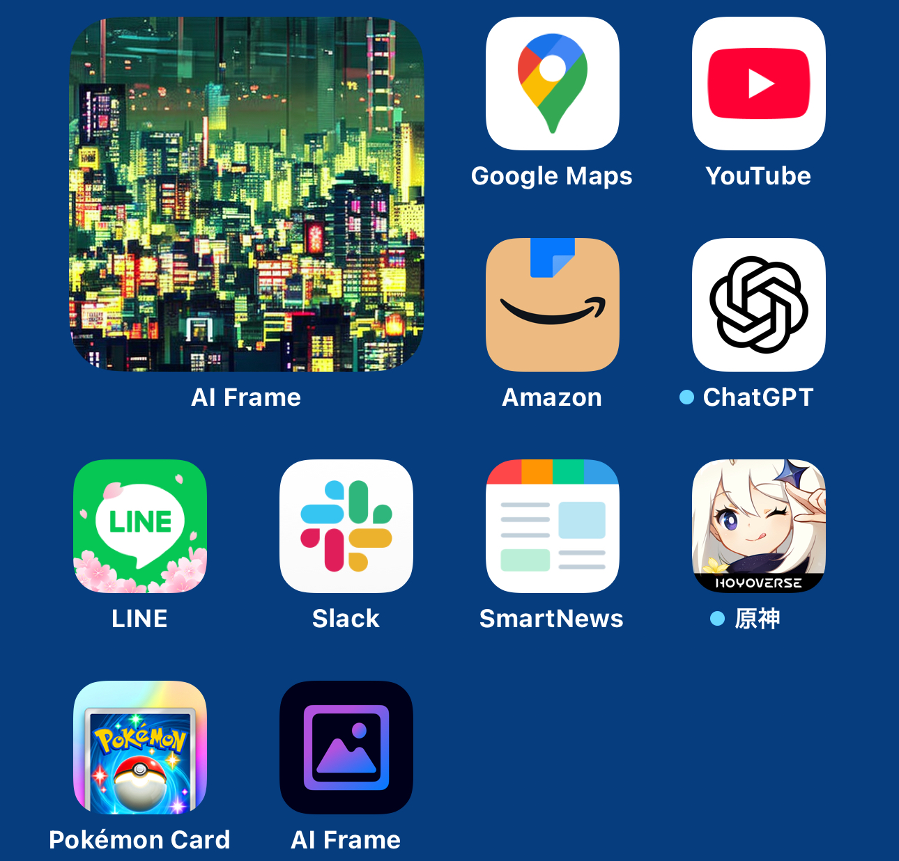

個人開発でiOSアプリをリリースした。

AI Frameという名前のアプリで、どんなアプリか簡単に紹介すると、
「アプリ内で画像を生成できて、生成した画像たちをウィジェットに飾ってホーム画面をなんかいい感じできる」というもの。

↓ こんな感じでホーム画面をいい感じにできます。

作るにあたってあらかじめ決めていたことは以下のとおり。

**画像生成はローカル、つまり端末内で行う。** 
これは画像生成を、BEにサーバーを立ててやるにしても、なんらかの画像生成AIサービスのAPIを叩くにしても、いずれにせよ個人では賄いきれないコストがかかることが予想されるため。

**あまりごちゃごちゃと機能を入れない。** 
単機能がベストで、そうでなくてもなるべくシンプルに倒す。

**広告は入れない** 
これは自分の考えるアプリの美意識に反するため。 
ゲームアプリに広告を入れるのは全然良いと思うけど、それ以外のユーティリティ系, ツール系アプリにはあまり広告を入れたくないというのが自分の考え。 
「広告を入れる」と決めた時点で、UIを設計するときに広告を入れるスペースを事前に計算する必要が出てくると思うけど、
その時点でそれは「アプリの本来の機能, 動作に不要な不純物」がUIの一部に組み込まれること前提で設計しなくてはならなくなることを意味するわけで、
あまりそういったことはしたくないなぁと思っています(個人の考えなので叩かないでね)。

**自分の好きなように開発する** 
仕事だと、積み重なった歴史や技術的負債, サポートOS, チーム状況など色々な制約があるので、
何もかもがベストプラクティスで最新の技術を使って開発することは到底無理な話だと思います。

でも個人開発なら上に挙げたことは一切なく、まっさらなキャンバスに自分だけが好き勝手に絵を描けるわけで、
「ぼくの考えたさいきょうの技術スタック」ではないけど、それに近いものを自分で選択/作り上げることができます。
そしてそれが個人開発の良い点の1つだと思うので、このアプリでは自分が好きな/使いたいライブラリや技術, サービスを自由に使うようにしました。

アプリの思想的な部分は以上。 
ここからはアプリの技術面について大まかに書いていきます。 

技術スタックは以下のような感じ。 
- 言語: Swift
- ライブラリ管理: Swift Package Manager
- プロジェクト構成: SPMマルチモジュール
- (UI)アーキテクチャ, 状態管理: The Composable Architecture(TCA)
- CI/CD: Xcode Cloud
- 課金周り: StoreKit2

それぞれについて。

**言語: Swift** 
言わずもがなですが、なんでFlutter/Dartにしなかったかというと 
- 画像生成周りの機能をAndroidの方も頑張るにはちょっと重かったから
- iOSアプリをネイティブで作りたかったから

です。

**ライブラリ管理: Swift Package Manager** 
デファクトなので。
ここはもうこれ一択だと思う。

**プロジェクト構成** 
個人開発なのでモジュール同士の依存がどうのこうのというところまで考えなくていいとは思うけど、
自分はちゃんとやりたい派なので、クリーンアーキテクチャの円の単位でSwift Packageを作り、それぞれ
一方向に依存するようにしました。 
モジュールを機能(Feature)単位で切る場合もありますが、アプリの規模的にそこまで機能が多くないので、そうはしませんでした。

**(UI)アーキテクチャ, 状態管理: The Composable Architecture(TCA)** 
途中で力尽きたので気が向いたら続きを書きます🙏
