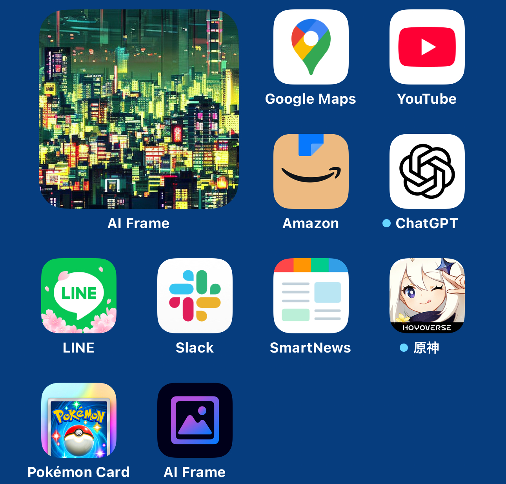

個人開発でiOSアプリをリリースしました。
https://apps.apple.com/ja/app/ai-frame-art-on-widget/id6740455268

AI Frameという名前のアプリで、どんなアプリか簡単に紹介すると、
「アプリ内で画像を生成できて、生成した画像たちをウィジェットに飾ってホーム画面をおしゃれにできる」というものです。

↓ こんなふうにホーム画面をなんかええ感じにできます。

技術スタックは以下の通りです。
- 言語: Swift
- ライブラリ管理: Swift Package Manager
- プロジェクト構成: SPMマルチモジュール
- (UI)アーキテクチャ, 状態管理: The Composable Architecture(TCA)
- CI/CD: Xcode Cloud
- 課金周り: StoreKit2

工夫というか割と頑張ったことをつらつら書いていきます。

### 画像生成の質問題
画像生成は、BEでサーバーを立てていたり外部サービスのAPIを叩いているわけではなく、端末内で生成しています。 
なので、(メモリが許す限りは)お金の心配やリミットを気にせず生成できます。 
その代わり、アプリに組み込む関係上高性能なモデルは載せられないので、モデルサイズを落とした圧縮版を使っています。 
この部分、 
質の良い画像を生成したいのでなるべく高性能なモデルを使いたい 
vs 
高性能なモデルを使うとアプリの容量制限(確か2GB以下推奨)を超えてしまう 
という制限の中でどうにかしないいけないので、割と悩みました。 
ここはこれからの画像生成AIの発展に期待ですね。

### CI/CDで画像生成関連ファイルをどうするか問題
CI/CDはXcode Cloudを使用しています。 
個人だと25コンピューティング時間分が無料でめちゃくちゃ使わない限り無料範囲に収まるのと、
GitHub Action以外のCI/CDサービスということで、以前から使ってみたかったからという理由で選択しました。

それで、developブランチにpushした際にテスト/アーカイブ -> TestFlightで配信まで自動でできるのでそのようにしているのですが、
ここで画像生成モデル関連ファイルの存在が問題になりました。

というのも、モデル関連ファイル(.mlmodelファイル)は全体で1GBぐらいあるのですが、これを直接GitHubに上げるわけにはいきません。
(容量制限があるのでgitコマンドでは無理) 
だからといって.gitignoreに入れて管理外としてしまうと、TestFlightで配布したアプリがモデル関連ファイル抜きのものになってしまい、動かなくなります。

というわけで、どうにかGitHubにpushしようと思い、巨大なファイルをgitコマンドで扱うための拡張機能であるgit-lfsを使うことをまず検討しました。 
のですが、GitHubのFreeプランだと1リポジトリにつき最大1GBまでしかgit-lfs管理下のファイルを扱えないことが分かり、断念しました。 
(ギリギリ1GBを超えていたので、このあと数MBのために課金するのはちょっと...という思いがあった)

そのあと色々考えた結果、以下のようにして対処するようにしました。
1. .mlmodelファイルは.gitignoreに入れ、リモートにはpushしない
2. .mlmodelファイルは別途Amazon S3に格納しておく
3. Xcode Cloudのci_post_cloneスクリプトで、aws-cliを使ってS3から.mlmodelファイルを落とす
4. 所定のディレクトリ配下に配置し、完全体にしてからCI/CDに通す

Xcode Cloudはci_scriptsで
- GitHubからクローン後
- ビルド前
- ビルド後

の3つのタイミングでShellスクリプトを実行できるのですが、この中のクローン後のタイミングで上記の手順を実行するようにしました。 
色々面倒でしたが結果的にXcode Cloudを満遍なくキャッチアップできた気がするので良かった。

### TCAと課金まわり
仕事でTCAを使って開発しているので、TCA自体には特に困ることなくサクサク開発できたと思っています。 
むしろTCAのおかげで個人開発レベルの規模といえどかなり綺麗にコードが書けたと思っている(自画自賛)。

ただ課金周りについては、StoreKit2の一部にViewと密結合にしないと扱えないようなAPIがあったりして、
TCAのProsであるテストしやすい状態の持ち方との折り合いが付きにくい部分があり、
そこについては少し頭を悩ませました。

ちなみにRevenueCatのような課金サポートサービスは使っていません。

---
技術的な部分についてはこんな感じ。
もちろんリリースしただけで満足したわけではないので、
これからは運用とマーケティングなどもしっかりやっていきます💪
