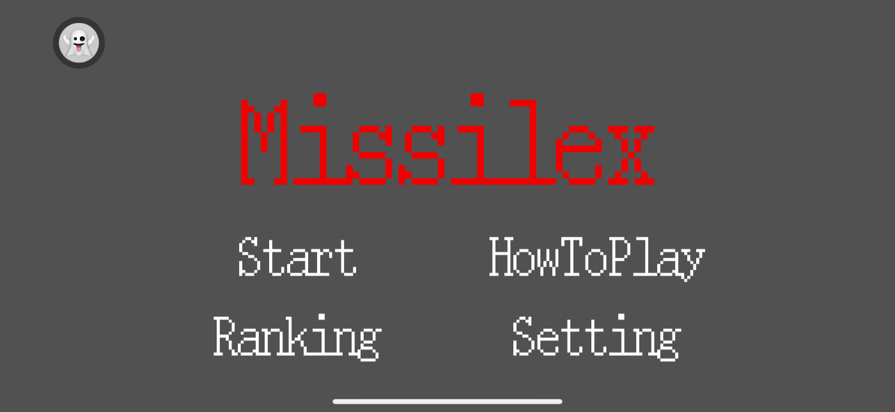
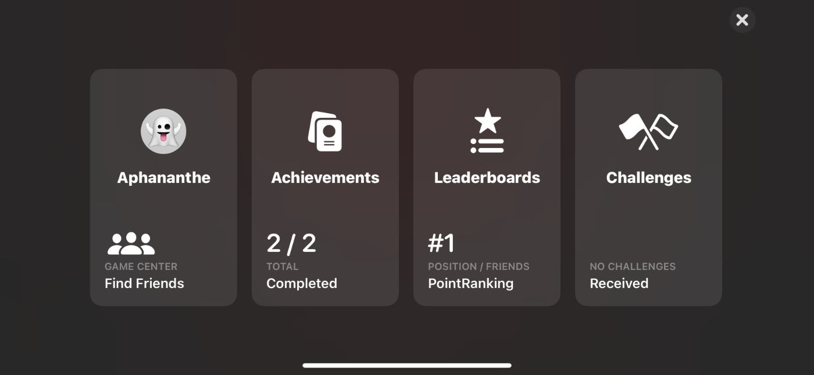
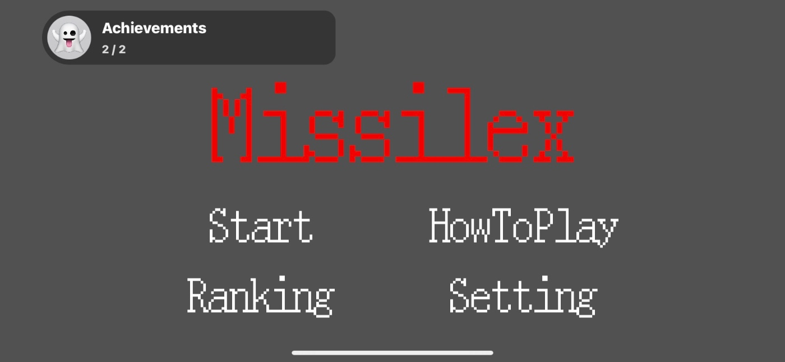
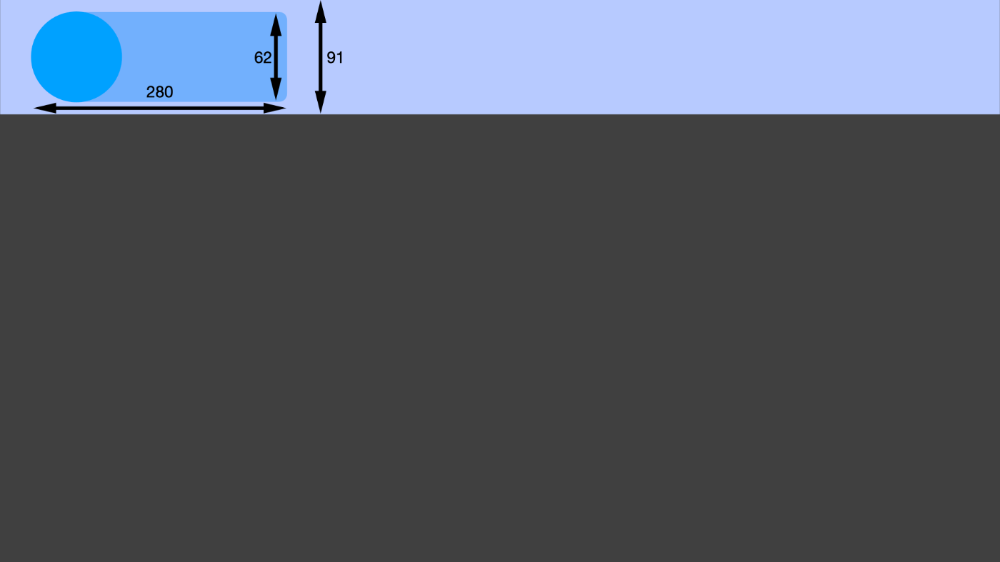

※Qiitaから移行した記事です(投稿日 2021年01月01日)

## はじめに

iOS14からGameKitでGKAccessPointというものが使えるようになりました。
ランキングを表示するLeaderboardsや、ゲーム内の達成項目を表示するAchievementsにワンタップでアクセスできるようにするボタンのようなものです。
非常に簡単に導入できるので、おすすめです。

## GKAccessPointとは

以下画像の左上にあるアイコンのようなものです。
画面の四隅のうちどれかに設置することができ、今回私の場合は左上に設置しています。
Appleはなるべく左上に設置することを推奨しています。


AccessPointをタップすると以下のようなGameCenterの画面が表示されます。
このメニュー画面のことをDashboardと呼びます。
AppStoreConnect内でのGameCenterの設定によってDashboardに表示される項目は変わります。
なお、Dashboardを経由せずに直接Leaderboardsやユーザープロフィールを表示させることもできます。


## 導入前の注意

GKAccessPointには、.showHighlightsというBool型のプロパティがあります。
この値をtrueにすると、AccessPointが表示されるたびに以下のようなユーザーの現在順位や獲得Achievement数についてのハイライトが数秒の間表示されます。なので.showHighlightsをtrueにする場合、このハイライトの表示領域がゲーム画面のUIに被らないよう注意する必要があります。


横画面の場合、AccessPointのポイント数は以下のようになります。(iPhone11Proの場合)
縦幅62pt, 横幅280ptで、セーフエリアは91pt空けておくことが推奨されています。
ちなみに縦画面の場合、縦62pt, 横335ptで、セーフエリアは114pt推奨です。


## 実装方法

#### AppStoreConnectにアプリを登録し、GameCenter機能をオンにする

GameCenterの機能なので、
AppStoreConnectにアプリを登録後、GameCenterのチェックボックスをオンにします。
ついでに 機能 -> GameCenter
でLeaderboardsやAchievementの追加を行なっておくと良いです。

#### Xcodeの設定

Project -> General -> Capabilities -> Game Center をオン Project -> General ->
Linked Frameworks and Libraries でGameKit.Frameworkを追加

#### GameCenterのログイン処理

GameCenterにユーザーがログインしていないとAccessPointが使えません。
なのであらかじめアプリ起動直後にGameCenterへのログイン処理を完了している必要があります。
GKAccessPointとは直接関係はないので説明は省略しコードだけ載せさせていただきます。
私は以下のように書きました。 GameCenterにユーザーがサインインしていない場合、
GKLocalPlayer.local.authenticateHandlerの引数viewControllerにサインイン専用のViewControllerが入りますので、それを表示させます。
ユーザーがそもそも設定でGameCenter機能をオフにしている場合、errorになります。
サインイン成功した場合はGameCenter側で勝手に認証してくれますので、何もする必要はありません。

```swift:GameCenterLocalPlayer.swift
struct GameCenterLocalPlayer {

   static func loginGameCenter(target: UIViewController) {
        GKLocalPlayer.local.authenticateHandler = { viewController, error in
            if error != nil {
                let alert = UIAlertController(title: "Game Center", message: "To join the ranking,\nPlease sign in to GameCenter.", preferredStyle: .alert)
                let alertAction = UIAlertAction(title: "OK", style: .default, handler: nil)
                alert.addAction(alertAction)
                target.present(alert, animated: true)
            }
            if let _viewController = viewController {
                target.present(_viewController, animated: true)
            }
        }
    }

}
```

```swift:AppDelegate.swift
class AppDelegate: UIResponder, UIApplicationDelegate {

   var window: UIWindow?

    func application(_ application: UIApplication, didFinishLaunchingWithOptions launchOptions: [UIApplication.LaunchOptionsKey: Any]?) -> Bool {

        self.window = UIWindow(frame: UIScreen.main.bounds)
        self.window?.rootViewController = UIStoryboard(name: "Main", bundle: nil).instantiateInitialViewController()
        self.window?.makeKeyAndVisible()

        if let presentView = window?.rootViewController {
            GameCenterLocalPlayer.loginGameCenter(target: presentView)
        }

        return true
    }

}
```

#### GKAccessPointのコードを書く

最後にGKAccessPointを呼び出します。
ご覧の通り呼び出しはsharedという共有シングルトンを介して行います。
AppleはなるべくゲームのメインメニューにてAccessPointを呼ぶよう推奨しています。
私はSpriteKitを使っていたので、メニューSceneのdidMoveメソッド内に書きました。
なお、AccessPointは一度呼び出すとSceneをまたいでも消えないので、例えばゲームのプレイ画面などではisActiveをfalseにしてAccessPointを消すようにしましょう。

```swift:HogehogeScene.swift
override func didMove(to view: SKView) {
        GKAccessPoint.shared.location = .topLeading
        GKAccessPoint.shared.showHighlights = true
        GKAccessPoint.shared.isActive = true
}
```

ぜひ試してみてください。

## 参考サイト

https://developer.apple.com/videos/play/wwdc2020/10618
